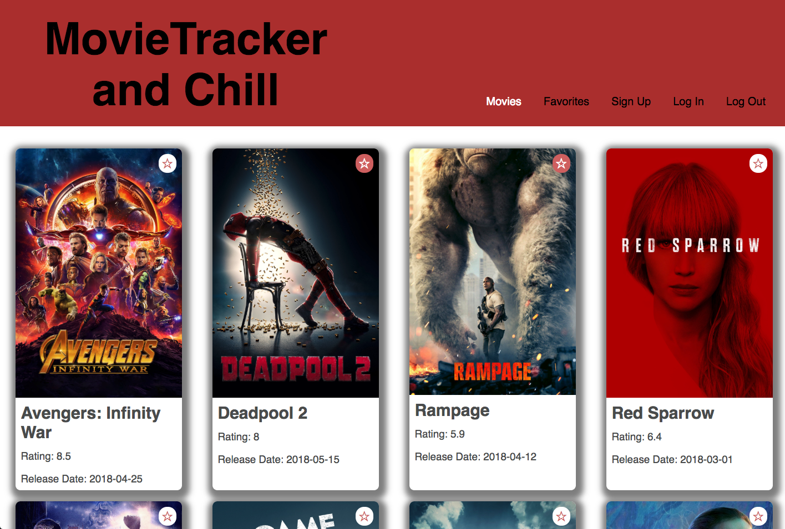

# Movie Tracker and Chill

## Synopsis

MovieMasher is an app allowing users to browse a database of movies. The user can create an account to save their favorite movies, for future reference. 

### Tools 

* Movie data from [MovieDB](https://www.themoviedb.org/documentation/api)

### *Example* 

---

## Contributors

* [Daniela Carey](https://github.com/danielafcarey)
* [Seamus Quinn](https://github.com/seamus-quinn)
* [Austin Wiedenman](https://github.com/Awiedenman)

_(**Turing School of Software & Design Front-end Engineering project - Mod 3:** [MovieTracker Project Spec](https://github.com/turingschool-examples/movie-tracker))_ 

